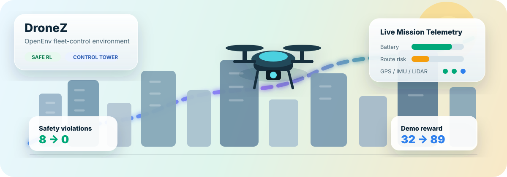
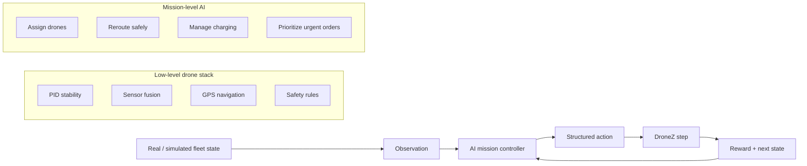
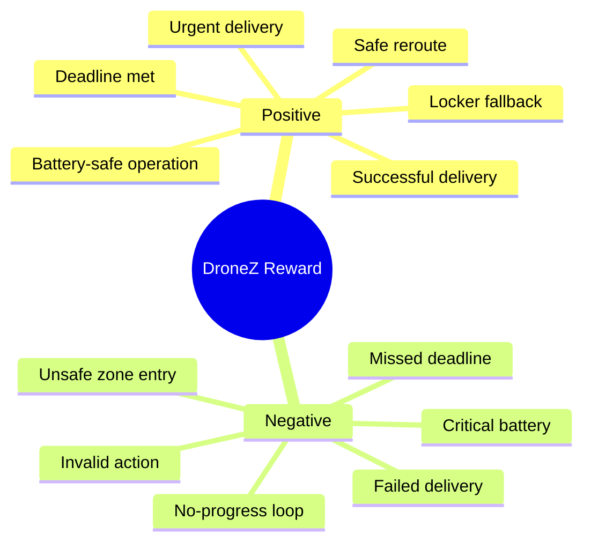
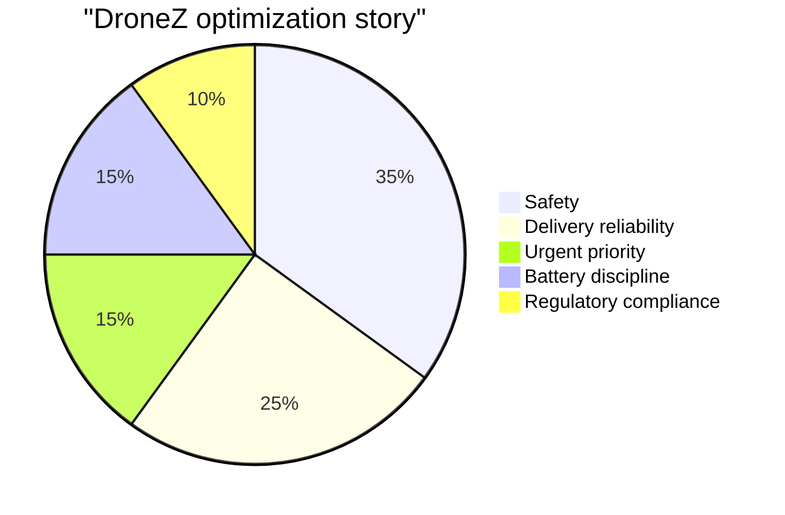
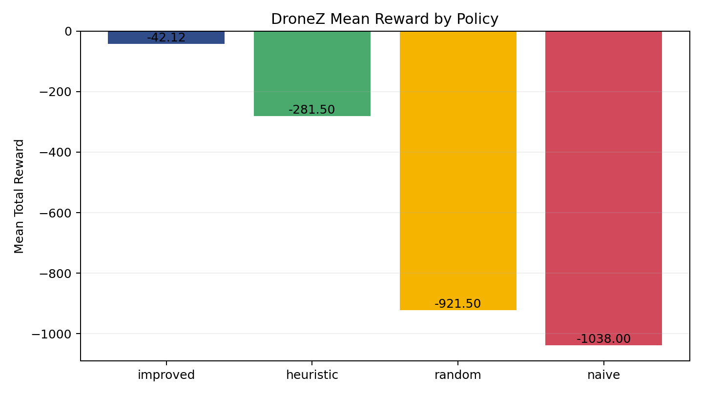
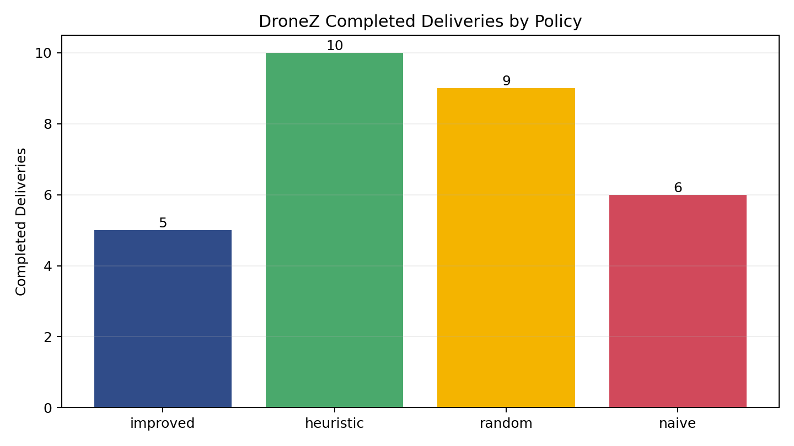
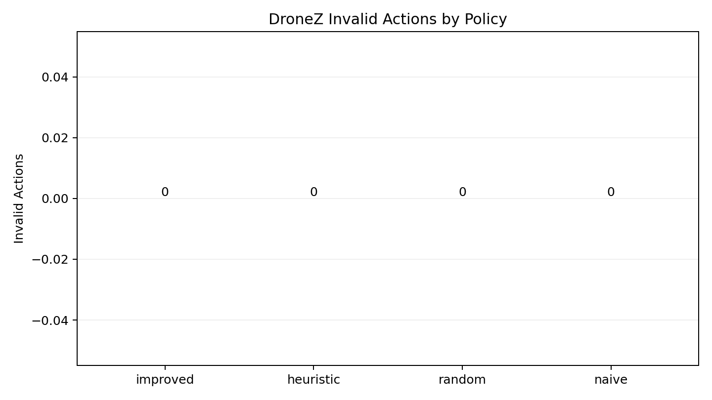
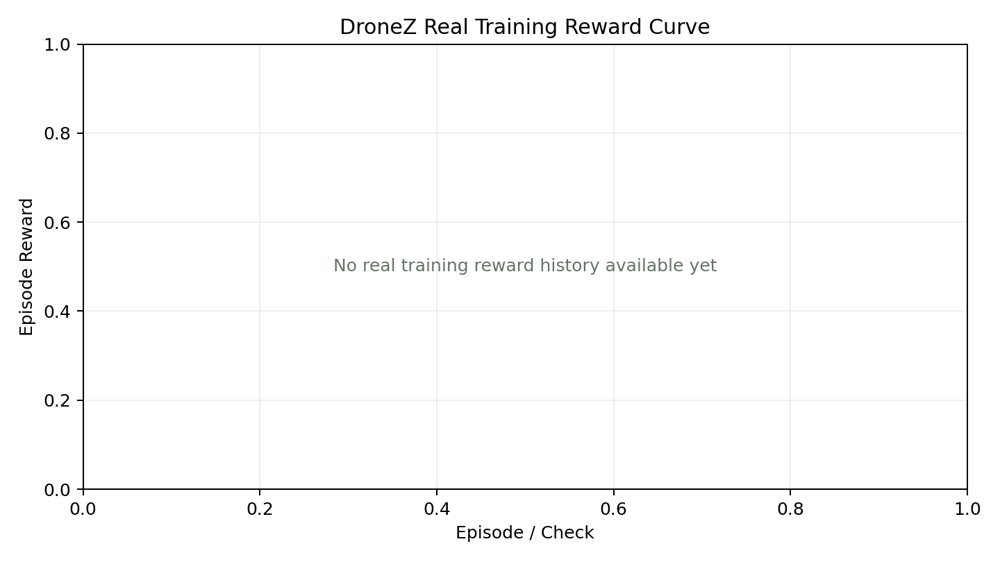
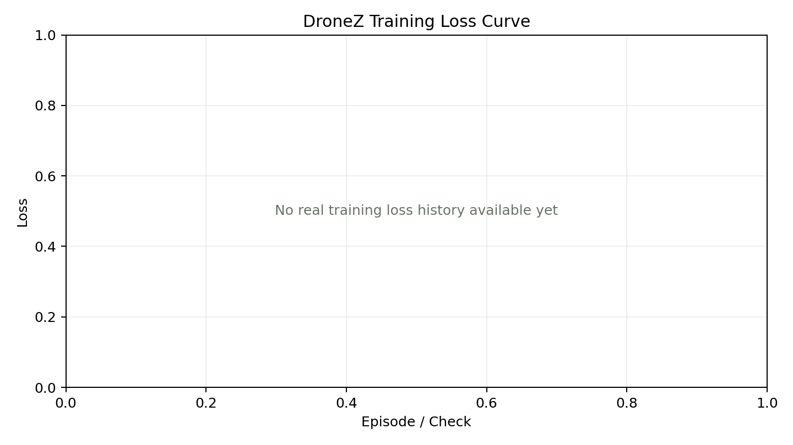
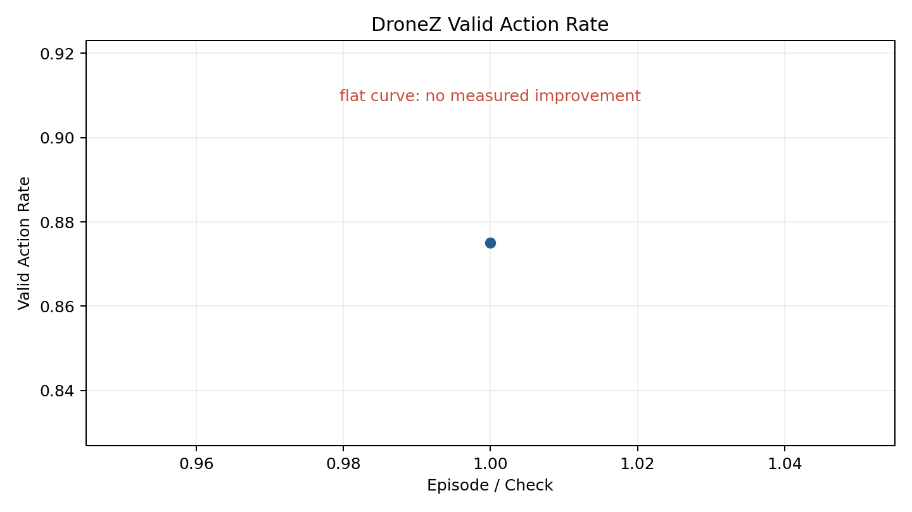

<p align="center">
  
</p>

<h1 align="center">DroneZ Fleet Delivery Environment</h1>

<p align="center">
  <b>OpenEnv RL environment for mission-level autonomous drone fleet control.</b>
  <br/>
  Train and evaluate fleet decisions under weather, no-fly zones, battery limits, urgent orders, charging constraints, and delivery uncertainty.
</p>

<p align="center">
  <a href="https://krishna2521-dronez-openenv.hf.space" target="_blank" rel="noopener noreferrer">Live Runtime</a>
  ·
  <a href="https://krishna2521-dronez-openenv.hf.space/demo/index.html" target="_blank" rel="noopener noreferrer">Control Tower Demo</a>
  ·
  <a href="https://krishna2521-dronez-openenv.hf.space/docs" target="_blank" rel="noopener noreferrer">API Docs</a>
  ·
  <a href="https://huggingface.co/spaces/Krishna2521/dronez-openenv" target="_blank" rel="noopener noreferrer">HF Space</a>
  ·
  <a href="docs/README.md">Docs</a>
</p>

<p align="center">
  
  
  
  
  
</p>

## ✨ One-Line Pitch

DroneZ turns drone delivery operations into a reward-driven OpenEnv environment where an AI control tower learns mission-level decisions: assign drones, route safely, prioritize urgent orders, manage charging, and recover from disruptions.

## 🚀 Quick Access

| Resource | Link |
| --- | --- |
| Hugging Face Space Repository | https://huggingface.co/spaces/Krishna2521/dronez-openenv |
| Post-submission Staging Space | https://huggingface.co/spaces/Krishna2521/Meta_Drone_env |
| Staging Agent Playground | https://krishna2521-meta-drone-env.hf.space/agent |
| 3D Simulator Public URL | https://creative-klepon-8a1f8a.netlify.app/ |
| 3D Simulator Static Folder | [simulator_public/](simulator_public/) |
| 3D Simulator Deploy Guide | [README_DEPLOY.md](README_DEPLOY.md) |
| Showcase Folder | https://drive.google.com/drive/folders/1EvQvEcNg9AasMICUYt_AkMDGtoTlMbJE?usp=sharing |
| Live Runtime | https://krishna2521-dronez-openenv.hf.space |
| Live Demo | https://krishna2521-dronez-openenv.hf.space/demo/index.html |
| API Docs | https://krishna2521-dronez-openenv.hf.space/docs |
| Health Check | https://krishna2521-dronez-openenv.hf.space/health |
| Team GitHub Repo | https://github.com/Hollenite/DroneZ.git |
| Blog / Writeup | [BLOG.md](BLOG.md) |
| Full Documentation | [docs/README.md](docs/README.md) |

> Post-submission safety note: the official submitted Space remains `Krishna2521/dronez-openenv`. The `Krishna2521/Meta_Drone_env` Space is a staging environment for safe post-submission agent-playground improvements.

## 🧠 What DroneZ Actually Is

DroneZ is not a low-level drone motor-control simulator. It does not train an RL model to directly spin propellers.

DroneZ is a mission-level drone fleet operations environment:

- 🚁 **Classical drone systems** handle PID stability, GPS navigation, sensor fusion, Kalman-style state estimation, geofencing, and emergency safety rules.
- 🤖 **RL/AI control** handles assignment, rerouting, charging, urgent-order priority, delivery recovery, and mission optimization.
- 🗼 **Control tower logic** monitors the fleet, dispatches missions, handles exceptions, and applies organization-level safety policy.

That hybrid boundary is the core idea. Real drones are not pure RL machines; they are stable robotics systems with AI at the decision layer.



## 🏙️ Environment Design

Each episode simulates a drone delivery operation with:

- drones with battery, route, payload capacity, health, and assignment state
- orders with priority, deadline, destination, recipient availability, and fallback options
- sectors with weather, congestion, no-fly restrictions, and safety risk
- charging stations with limited capacity
- disruptions such as storms, failed drops, urgent-order changes, and restricted zones

The agent sees the world, chooses a structured action, receives a reward, and continues until all orders are resolved or the episode ends.

## 🧪 Use DroneZ as an RL Environment

DroneZ is an interactive environment, not only a replay dashboard. The core agent loop is:

```text
reset -> observation -> action -> step -> reward + done + info -> repeat
```

Staging agent playground:

```text
https://krishna2521-meta-drone-env.hf.space/agent
```

Useful staging endpoints:

- `GET /env-spec` explains the environment contract.
- `GET /action-space` lists allowed action names and required parameters.
- `GET /observation-space` explains observation fields.
- `POST /valid-actions` returns currently valid candidate actions.
- `POST /reset` starts an episode.
- `POST /step` applies one JSON action and returns reward/done/info.

Minimal remote loop:

```python
import requests

BASE = "https://krishna2521-meta-drone-env.hf.space"

reset = requests.post(f"{BASE}/reset", json={"task_id": "easy"}).json()
for t in range(20):
    candidates = requests.post(f"{BASE}/valid-actions", json={}).json()["actions"]
    action = candidates[0]["action"]
    result = requests.post(f"{BASE}/step", json={"action": action}).json()
    print(result["reward"], result["done"], result["info"].get("done_reason"))
    if result["done"]:
        break
```

Visual demo vs environment API:

- `demo_ui/` visualizes traces and explains the hybrid drone control-tower story.
- `/reset`, `/step`, `/state`, and `/valid-actions` are the actual interactive RL API.
- `examples/` contains remote agent scripts for calling the deployed Space.

## 🎮 Action Space

| Action | Meaning |
| --- | --- |
| `assign_delivery` | Assign an order to a drone. |
| `attempt_delivery` | Attempt delivery when the drone reaches the destination. |
| `reroute` | Change route around weather, risk, or no-fly zones. |
| `prioritize_order` | Move an urgent order higher in the queue. |
| `fallback_to_locker` | Use a safe locker if the recipient is unavailable. |
| `return_to_charge` | Send a drone to a charging station. |
| `reserve_charger` | Reserve charging capacity. |
| `hold_fleet` | Pause operations in unsafe conditions. |
| `resume_operations` | Restart operations after a hold. |

## 🏆 Reward Design

DroneZ rewards safe, useful progress and penalizes unsafe or wasteful behavior.





## 📊 Evaluation Results

Results are generated from [artifacts/results/policy_comparison.json](artifacts/results/policy_comparison.json) and [artifacts/results/policy_comparison.csv](artifacts/results/policy_comparison.csv).

### Aggregate Evaluation Across Easy, Medium, Hard, and Demo

| Policy | Mean Reward | Mean Normalized Score | Deliveries | Urgent Successes | Safety Violations | Invalid Actions |
| --- | ---: | ---: | ---: | ---: | ---: | ---: |
| improved | **-42.125** | **0.3051** | 5 | 3 | **0** | 0 |
| heuristic | -281.500 | 0.0797 | 10 | 5 | 182 | 0 |
| random | -921.500 | 0.0100 | 9 | 4 | 396 | 0 |
| naive | -1038.000 | 0.0100 | 6 | 3 | 497 | 0 |

### Demo Scenario Headline

| Policy | Reward | Normalized Score | Deliveries | Urgent Successes | Safety Violations | Invalid Actions |
| --- | ---: | ---: | ---: | ---: | ---: | ---: |
| improved | **89.0** | **0.5861** | 2 | 1 | **0** | 0 |
| heuristic | 32.0 | 0.2889 | 2 | 1 | 8 | 0 |
| random | -162.5 | 0.0100 | 2 | 1 | 33 | 0 |
| naive | -607.5 | 0.0100 | 0 | 0 | 72 | 0 |

Demo takeaway: the deterministic improved policy keeps the same delivery count as the heuristic baseline while reducing safety violations from `8` to `0` and increasing reward from `32.0` to `89.0`.

<p align="center">
  
  
  
</p>

## 🧪 Training Status

The current proven improvement is deterministic policy improvement, not trained-model reward improvement.
A real GRPO-style run was attempted on an NVIDIA RTX 5060 Laptop GPU using `Qwen/Qwen2.5-0.5B-Instruct`.

What was improved after that failure:

- compact action prompts
- robust JSON parsing
- safe action repair
- candidate-choice mode
- format-check diagnostics
- SFT warm-start data from improved-policy traces

Current format diagnostics:

| Metric | Value |
| --- | ---: |
| `valid_json_rate` | `0.875` |
| `valid_action_rate` | `0.875` |
| SFT examples | `108` |

Training plots:

<p align="center">
  
  
  
</p>

Honest claim: DroneZ includes a runnable training pipeline and real diagnostics, but no trained GRPO reward improvement is claimed yet.

Colab path:

- Public notebook: https://colab.research.google.com/drive/1ge0s9eYcbeE25oEXh6t-wySGh3ZCR9AV
- Repo notebook: [notebooks/train_dronez_grpo_colab.ipynb](notebooks/train_dronez_grpo_colab.ipynb)
- Guide: [docs/training/COLAB_TRAINING.md](docs/training/COLAB_TRAINING.md)

The notebook runs dry-run setup, action-format diagnostics, SFT data generation, plot display, artifact zipping, and optional candidate-choice GRPO if a GPU is available.

For Colab real training, start with the safe smoke command:

```bash
python scripts/train_grpo_local.py --real-train --candidate-choice --safe-generation --no-sampling \
  --model Qwen/Qwen2.5-0.5B-Instruct \
  --tasks easy --eval-tasks easy \
  --episodes 2 --group-size 1 \
  --learning-rate 1e-6 --max-new-tokens 16 \
  --output-dir artifacts/training/candidate_grpo_smoke
```

If CUDA reports a device-side assert, restart the Colab runtime before retrying.

## 🖥️ Demos

### Hugging Face Control Tower Demo

The hosted browser replay uses real DroneZ JSON traces and presents them as a professional hybrid-drone control tower.

Features:

- 2.5D procedural city map
- route corridors and mission events
- drone telemetry cards
- weather and no-fly overlays
- charging stations and order markers
- reward evolution and event timeline
- control-tower status

Open: https://krishna2521-dronez-openenv.hf.space/demo/index.html

### Standalone Cinematic Simulator

The repo includes one standalone visual simulator:

```bash
python -m http.server 8090
```

Open:

```text
http://127.0.0.1:8090/dronez_world_sim/index.html
```

This simulator is for visual storytelling. The OpenEnv runtime remains the source of truth.

## 🛠️ Run Locally

Install:

```bash
python -m pip install -e .
```

Start the API:

```bash
python -m uvicorn server.app:app --host 127.0.0.1 --port 8000
```

Open:

```text
http://127.0.0.1:8000
http://127.0.0.1:8000/demo/index.html
http://127.0.0.1:8000/docs
```

Check endpoints:

```bash
curl http://127.0.0.1:8000/health
curl http://127.0.0.1:8000/tasks
curl http://127.0.0.1:8000/api
curl http://127.0.0.1:8000/artifacts/traces/demo_improved_enriched.json
```

## 🐳 Docker

```bash
docker build -t dronez .
docker run --rm -p 8000:7860 dronez
```

## 📦 Repository Layout

```text
DroneZ/
├── README.md                  # public judge-facing overview
├── BLOG.md                    # writeup / article
├── PITCH.md                   # short pitch script
├── SUBMISSION_CHECKLIST.md    # final submission checklist
├── openenv.yaml               # OpenEnv metadata
├── Dockerfile                 # Hugging Face Space runtime
├── src/urbanair/              # core environment, simulator, policies, API helpers
├── server/                    # FastAPI entrypoint wrapper
├── demo_ui/                   # hosted HF control-tower demo
├── dronez_world_sim/          # standalone cinematic simulator
├── scripts/                   # eval, trace, plot, and training scripts
├── notebooks/                 # Colab training notebook
├── artifacts/                 # small results, plots, traces, training diagnostics
├── configs/                   # task, fleet, and reward configuration
├── tests/                     # test suite
└── docs/                      # learning, training, deployment, reports
```

## 📚 Documentation

The root is intentionally kept clean. Supporting docs live in [docs/](docs/README.md):

- [Learn DroneZ From Zero](docs/learning/LEARN_DRONEZ_FROM_ZERO.md)
- [File-by-File Guide](docs/learning/FILE_BY_FILE_GUIDE.md)
- [Tech Stack Explained](docs/learning/TECH_STACK_EXPLAINED.md)
- [Drone RL Product Architecture](docs/learning/DRONE_RL_PRODUCT_ARCHITECTURE.md)
- [Colab Training Guide](docs/training/COLAB_TRAINING.md)
- [Training Results Explained](docs/training/TRAINING_RESULTS_EXPLAINED.md)
- [HF Space Deployment](docs/deployment/HF_SPACE_DEPLOYMENT.md)
- [Final Readiness Report](docs/reports/FINAL_READINESS_REPORT.md)

## 🔁 Regenerate Results

```bash
python scripts/evaluate_policies.py
python scripts/generate_demo_trace.py --task easy --policy all
python scripts/generate_demo_trace.py --task medium --policy all
python scripts/generate_demo_trace.py --task hard --policy all
python scripts/generate_demo_trace.py --task demo --policy all
python scripts/enrich_demo_trace.py --task easy --policy all
python scripts/enrich_demo_trace.py --task medium --policy all
python scripts/enrich_demo_trace.py --task hard --policy all
python scripts/enrich_demo_trace.py --task demo --policy all
python scripts/generate_plots.py
```

Training diagnostics:

```bash
python scripts/train_grpo_local.py --sanity-check --model Qwen/Qwen2.5-0.5B-Instruct --output-dir artifacts/training/local_sanity
python scripts/train_grpo_local.py --format-check --model Qwen/Qwen2.5-0.5B-Instruct --tasks easy,demo --output-dir artifacts/training/format_check
python scripts/generate_sft_action_data.py --tasks easy,medium,demo,hard --output artifacts/training/sft_action_data.jsonl
```

## ⚠️ Limitations

DroneZ does not yet simulate:

- full Isaac Sim, Gazebo, AirSim, or real aerodynamics
- real motor or propeller control
- certified aviation behavior
- real GPS, camera, LiDAR, radar, or thermal streams
- proven trained-model reward improvement from GRPO

Visual telemetry in the demo is simulated metadata derived from environment traces, not real aircraft telemetry.

## ✅ Final Submission Status

- Environment: working
- OpenEnv API: working
- HF Space: live
- Docker: validated
- Tests: `79 passed`
- Deterministic improved policy: proven better than baselines on reward and safety
- Real GRPO improvement: attempted, but not proven yet
- Final submission URL: https://huggingface.co/spaces/Krishna2521/dronez-openenv

## 🧭 Final Takeaway

Drone delivery is not just about flying. It is about decision-making under uncertainty. DroneZ shifts the focus from fixed routes to adaptive fleet intelligence, where actions are evaluated through rewards and policies can move toward safer, faster, and more reliable delivery operations.
